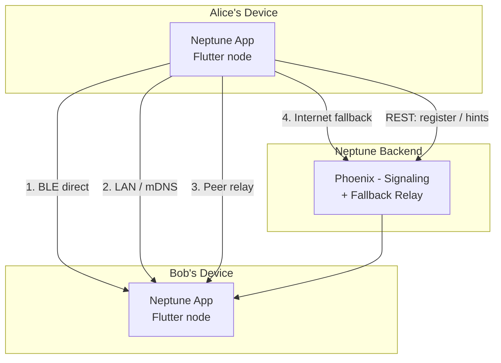

<div align="center">

# Neptune

**Privacy-first, open-source, ephemeral messaging. Every device is a node.**

[](https://flutter.dev)
[](https://elixir-lang.org)
[](https://phoenixframework.org)
[](LICENSE)
[](https://github.com/debojyoti452/neptune-chat)

<br/>

[](https://www.youtube.com/watch?v=n8Fjz8eYRIg)

*▶ Click to watch the demo*

</div>

---

## Core Principles

| | Principle |
|---|---|
| 🚫🗄️ | **Zero server persistence** — no chat content ever touches a backend database |
| 📡 | **Every device is a node** — each device acts simultaneously as client, server, and relay |
| 🔐 | **Everything on device is encrypted** — SQLCipher for structured data, hardware-backed Keychain/Keystore for keys |
| 🔀 | **Transport-agnostic** — messages route over BLE, LAN, peer relay, or internet fallback, automatically |
| 🔒 | **E2E encryption everywhere** — NIP-44 (ChaCha20-Poly1305) ensures the relay always sees ciphertext, never plaintext |
| ⚡ | **Nostr-compatible** — NIP-01 relay protocol, NIP-44 encryption, secp256k1 identity keys |

---

## Architecture Overview



See [docs/architecture.md](docs/architecture.md) for the full architecture including message flow, encryption pipeline, DI graph, supervision tree, and all protocol diagrams.

---

## Transport Priority

The `TransportRouter` selects the best available path automatically:

| Priority | Transport | Range | Internet Required |
|:---:|---|---|:---:|
| 🥇 1 | **BLE direct** | < 100 m | No |
| 🥈 2 | **LAN / mDNS** | Same network | No |
| 🥉 3 | **Peer relay** | Any distance | No |
| 4 | **Phoenix backend** | Any distance | Yes (fallback only) |

---

## Stack

<details>
<summary><strong>View full stack</strong></summary>

<br/>

| Component | Technology |
|-----------|------------|
| Mobile app | Flutter / Dart SDK ^3.12.2 |
| Embedded server | shelf + shelf_web_socket (NIP-01 relay) |
| Backend | Elixir 1.17 / Phoenix 1.8.9 / Bandit |
| Backend database | SQLite3 (dev/test) / PostgreSQL (prod) |
| Wire protocol | NIP-01 (Nostr WebSocket JSON) |
| BLE protocol | Native MethodChannel (Android + iOS) |
| E2E encryption | NIP-44: ECDH → HKDF-SHA256 → ChaCha20-Poly1305 |
| Identity keys | secp256k1 (Schnorr signing + ECDH in one keypair) |
| On-device storage | SQLCipher (AES-256) + flutter_secure_storage |
| State management | flutter_bloc / Cubit |
| Navigation | go_router |
| DI | get_it + injectable |

</details>

---

## Repository Structure

```
neptune-monorepo/
├── neptune_app/          Flutter - full node (client + embedded server + relay)
├── neptune_backend/      Elixir/Phoenix - signaling + fallback relay only
├── docs/
│   ├── architecture.md   System architecture + Mermaid diagrams
│   └── codebase.md       Annotated file tree for both projects
├── clean.sh
└── run.sh
```

See [docs/codebase.md](docs/codebase.md) for the full annotated file tree.

---

## Getting Started

### Prerequisites

- Elixir 1.17+ and Erlang/OTP 27+
- Flutter SDK (stable channel, Dart 3.12+)
- Bun (for asset tooling)
- PostgreSQL (production) or SQLite3 (development, zero setup)

### Backend

```sh
cd neptune_backend
mix setup        # deps + DB + assets
mix phx.server   # starts on http://localhost:4000
```

Development uses SQLite3 — no external database required.

### Flutter App

```sh
cd neptune_app
flutter pub get
dart run build_runner build --delete-conflicting-outputs
flutter run
```

Pass the backend URL at build time:

```sh
flutter run \
  --dart-define=NEPTUNE_RELAY_URL=ws://localhost:4000/nostr \
  --dart-define=NEPTUNE_API_URL=http://localhost:4000
```

> **First launch requires the backend.** On a clean install the app generates a secp256k1 keypair locally and calls `POST /api/v1/auth/register` to obtain a bearer token. Every subsequent launch reads the key locally — no network call is made.

---

## Security Model

- The backend stores only user identity (pubkey + auth token hash). Chat content is never written to any backend database.
- All on-device data is encrypted at rest via SQLCipher. The encryption key is stored in the OS hardware-backed keystore.
- Every message is signed with a BIP-340 Schnorr signature over the sender's secp256k1 private key. The relay verifies the signature before forwarding.
- NIP-44 E2E encryption means the relay processes only ciphertext — the conversation key never leaves the two endpoints.
- Ephemeral events (kinds 20000–29999) are never persisted by any NIP-01-compatible relay, including Neptune's own backend.

---

## API Surface

<details>
<summary><strong>REST endpoints</strong></summary>

<br/>

| Method | Path | Description |
|--------|------|-------------|
| POST | /api/v1/auth/register | Register secp256k1 pubkey, receive bearer token |
| POST | /api/v1/auth/revoke | Revoke current token |
| GET | /api/v1/health | Health check |
| GET | /api/v1/peers/:pubkey/hints | Get relay hints for a peer |
| PUT | /api/v1/peers/me/hints | Announce own relay hints |

</details>

<details>
<summary><strong>WebSocket (NIP-01)</strong></summary>

<br/>

```
ws(s)://host/nostr    NIP-01 relay - EVENT / REQ / CLOSE / OK / EOSE / NOTICE
```

</details>

<details>
<summary><strong>Protocol wire format</strong></summary>

<br/>

**Nostr Event (NIP-01)**

```json
{
  "id":         "<sha256 of canonical serialisation>",
  "pubkey":     "<sender secp256k1 pubkey, 64-char hex>",
  "created_at": 1700000000,
  "kind":       20001,
  "tags":       [["p", "<recipient pubkey>"]],
  "content":    "<NIP-44 ciphertext, base64>",
  "sig":        "<BIP-340 Schnorr signature, 128-char hex>"
}
```

**Ephemeral Kind Registry**

| Kind | Purpose |
|------|---------|
| 20001 | Ephemeral direct message |
| 20002 | Relay routing envelope |
| 20003 | BLE handshake / key exchange |

</details>

---

## Backend Development

<details>
<summary><strong>Commands and database adapters</strong></summary>

<br/>

```sh
cd neptune_backend
mix precommit        # compile + format + test (run before any commit)
mix test             # run tests only
mix ecto.reset       # drop + recreate + migrate + seed
```

**Database Adapters**

| Environment | Default | Override |
|-------------|---------|----------|
| dev | SQLite3 | Edit config/dev.exs |
| test | SQLite3 | Edit config/test.exs |
| prod | PostgreSQL | Set NEPTUNE_DB_ADAPTER=sqlite at build time |

Self-hosted with zero external dependencies:

```sh
NEPTUNE_DB_ADAPTER=sqlite mix release
SQLITE_DB_PATH=/data/neptune.db PHX_SERVER=true ./bin/neptune_backend start
```

</details>

---

## Roadmap

| Phase | Feature | Status |
|:---:|---------|:---:|
| 1 | Encrypted local storage + SQLCipher boot sequence | ✅ Done |
| 2 | secp256k1 identity keygen + NIP-44 encryption | ✅ Done |
| 3 | Device InboundServer (NIP-01 relay) + mDNS LAN discovery | ✅ Done |
| 4 | Ephemeral 1:1 chat — internet transport | ✅ Done |
| 5 | Phoenix backend fallback relay (NIP-01 compatible) | ✅ Done |
| 6 | BLE peer chat (Nostr events over native MethodChannel) | 🔄 In Progress |
| 7 | Peer relay routing (device-as-relay, TTL envelope) | 📋 Planned |
| 8 | Group chat (ephemeral, multi-transport) | 🔮 Future |
| 9 | Full Nostr relay mesh interoperability | 🔮 Future |
| 10 | Security audit + open source release | 🔮 Future |

---

## Contributing

See [CONTRIBUTING.md](CONTRIBUTING.md) for guidelines.

---

## Acknowledgements

Created by [Debojyoti Singha](https://github.com/debojyoti452).

Inspired by [BitChat](https://github.com/permissionlesstech/bitchat) — a decentralised, censorship-resistant mesh messaging app that works over Bluetooth without internet.

---

<div align="center">

Licensed under the [MIT License](LICENSE).

</div>
