# Neptune - Architecture

## Overview

Neptune is a privacy-first, open-source, ephemeral messaging platform. Every device running Neptune is a full node: it acts simultaneously as a client, a server, and a relay. The Phoenix backend exists only as a signaling coordinator and a last-resort internet relay - it never stores or reads message content.

---

## Monorepo Structure

```
neptune-monorepo/
├── neptune_app/          Flutter - full node (client + embedded server + relay)
├── neptune_backend/      Elixir/Phoenix - signaling + fallback relay only
└── docs/
    └── architecture.md
```

---

## System Context

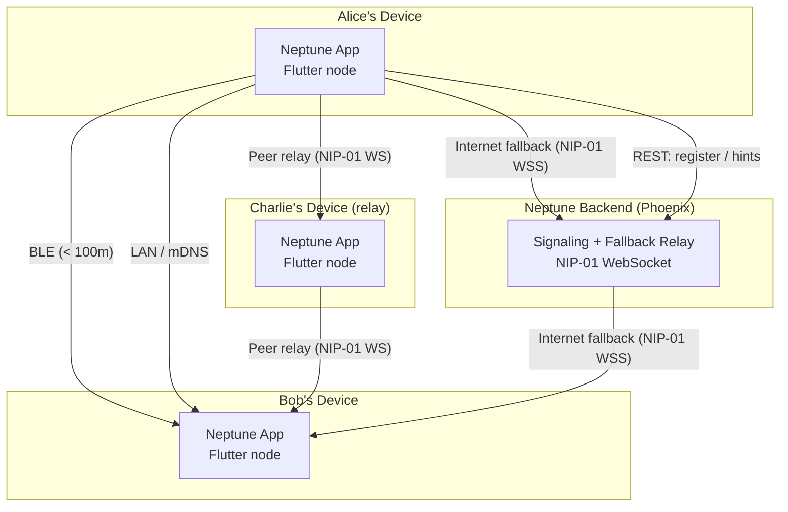

---

## Transport Priority

The `TransportRouter` selects the highest-priority available path automatically. Lower number = higher priority.

| Priority | Transport | Discovery | Range |
|----------|-----------|-----------|-------|
| 1 | BLE direct | Peripheral scan | < 100 m, no internet |
| 2 | LAN direct | mDNS (_neptune._tcp.local) | Same network |
| 3 | Peer relay | Backend hints / known peers | Any, no backend needed |
| 4 | Internet fallback | Phoenix backend relay | Any, internet required |

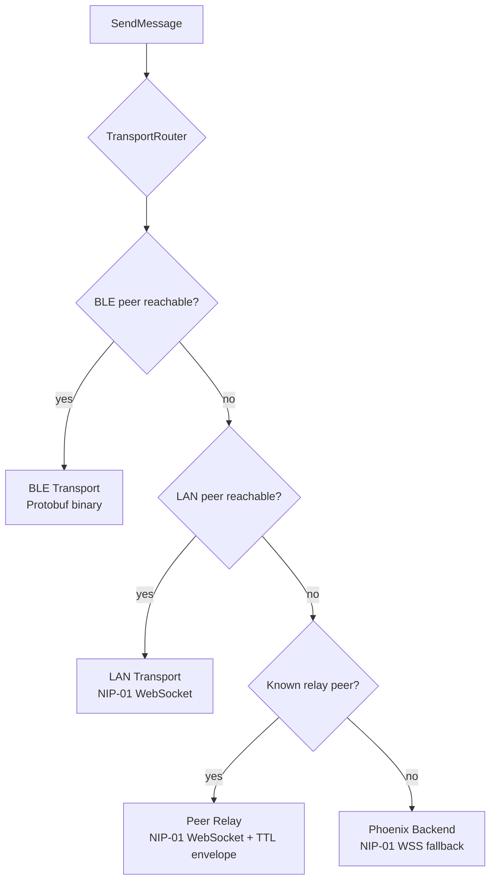

---

## Flutter App - Node Architecture

Every Neptune device runs four concurrent subsystems.

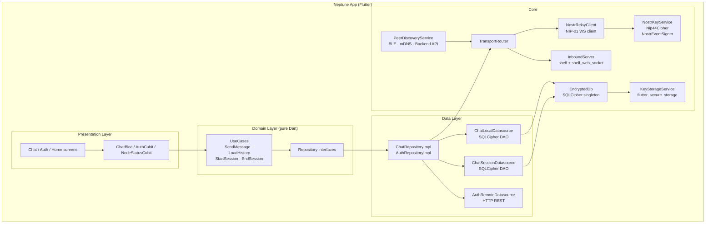

---

## Backend Architecture

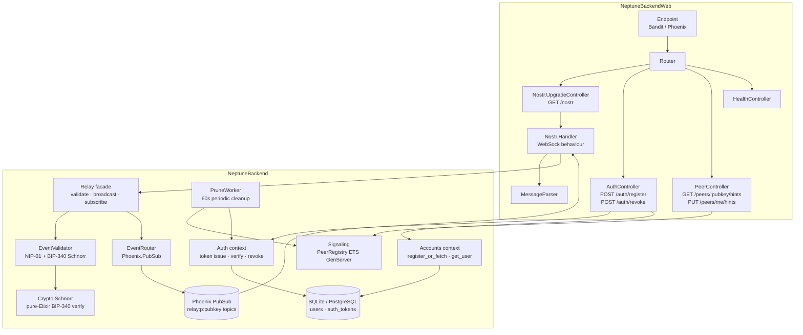

---

## Message Flow - End to End

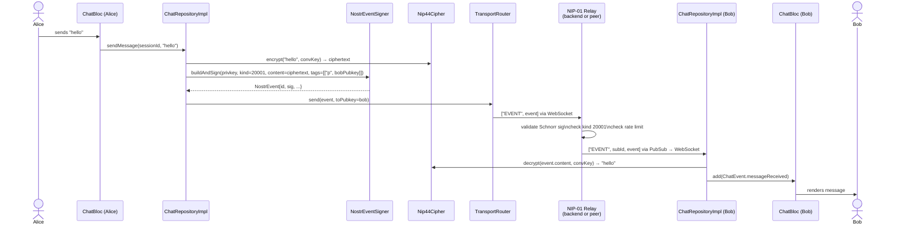

---

## Nostr Protocol Integration

Neptune uses NIP-01 as its wire protocol and NIP-44 for E2E encryption. All events are ephemeral (kinds 20000–29999) - no relay ever persists them.

### Event Shape

```json
{
  "id":         "<sha256 of canonical serialisation>",
  "pubkey":     "<sender secp256k1 hex pubkey, 64 chars>",
  "created_at": 1700000000,
  "kind":       20001,
  "tags":       [["p", "<recipient pubkey>"]],
  "content":    "<NIP-44 ciphertext, base64>",
  "sig":        "<64-byte Schnorr signature, hex>"
}
```

### Ephemeral Kind Registry

| Kind | Purpose |
|------|---------|
| 20001 | Ephemeral DM |
| 20002 | Relay routing envelope |
| 20003 | BLE handshake / key exchange |

### NIP-44 Encryption Pipeline

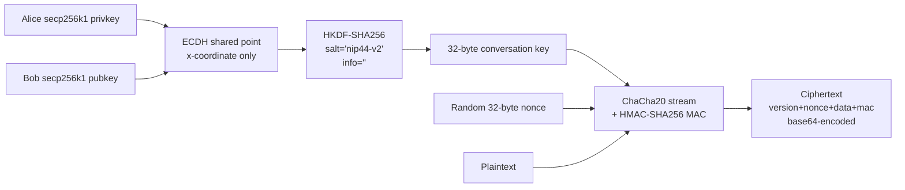

### Schnorr Signing (BIP-340)

Event IDs and signatures follow Nostr NIP-01 exactly:

```
id  = SHA256( JSON([0, pubkey, created_at, kind, tags, content]) )
sig = SchnorrSign(privkey, id)   -- BIP-340 / secp256k1
```

The Flutter app signs outgoing events via `NostrEventSigner`. The backend verifies them via the pure-Elixir `NeptuneBackend.Crypto.Schnorr` module (no native NIFs required).

---

## Encryption Strategy

| Data | Storage | Encryption |
|------|---------|------------|
| Identity private key | flutter_secure_storage | OS Keychain / Android Keystore (hardware-backed) |
| SQLCipher DB key | flutter_secure_storage | OS Keychain / Android Keystore (hardware-backed) |
| Chat messages (payload) | SQLCipher | AES-256 at rest (SQLCipher) + NIP-44 E2E at content level |
| Session conversation keys | SQLCipher | AES-256 at rest |
| Peer routing table | SQLCipher | AES-256 at rest |
| App settings | SQLCipher | AES-256 at rest |
| In-transit (internet) | TLS 1.3 | Phoenix endpoint + NIP-44 payload |
| In-transit (BLE) | NIP-44 app layer | BLE link encryption not relied upon |
| In-transit (LAN) | NIP-44 app layer | Local network TLS optional |

### Boot Sequence

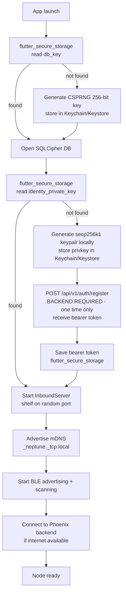

**Backend dependency summary:**

| Scenario | Backend required? |
|----------|------------------|
| First install / clean app data | Yes - `POST /auth/register` to get bearer token |
| Subsequent launches | No - privkey read locally, pubkey derived on-device |
| Sending messages (BLE / LAN / peer relay) | No |
| Sending messages (internet fallback) | Yes |
| Fetching peer hints | Yes |
| Announcing own LAN hints | Yes |

The keypair itself is always generated locally (`NostrKeyService.generateKeyPair()`). The backend call is only for issuing an auth token used by the relay and peer-hint endpoints. If the backend is unreachable on first launch, the app will block at registration and the identity will not be created.

---

## SQLCipher Schema

All structured data on-device lives in a single SQLCipher database. There is no plaintext storage.

```sql
CREATE TABLE messages (
  id          TEXT PRIMARY KEY,
  session_id  TEXT NOT NULL,
  peer_id     TEXT NOT NULL,
  ciphertext  BLOB NOT NULL,
  nonce       BLOB NOT NULL,
  direction   TEXT NOT NULL,     -- 'sent' | 'received'
  transport   TEXT NOT NULL,     -- 'internet' | 'lan' | 'ble' | 'relay'
  sent_at     INTEGER NOT NULL   -- unix ms
);

CREATE TABLE sessions (
  id               TEXT PRIMARY KEY,
  peer_id          TEXT NOT NULL,
  peer_public_key  BLOB NOT NULL,
  shared_secret    BLOB NOT NULL,
  transport        TEXT NOT NULL,
  started_at       INTEGER NOT NULL
);

CREATE TABLE peers (
  id             TEXT PRIMARY KEY,
  display_name   TEXT,
  public_key     BLOB NOT NULL,
  last_seen_at   INTEGER,
  last_transport TEXT
);

CREATE TABLE routing_table (
  peer_id            TEXT NOT NULL,
  via_peer_id        TEXT,
  transport          TEXT NOT NULL,
  reachability_score REAL,
  last_updated       INTEGER NOT NULL
);

CREATE TABLE settings (
  key        TEXT PRIMARY KEY,
  value_blob BLOB NOT NULL
);
```

---

## Backend REST API

| Method | Path | Auth | Description |
|--------|------|------|-------------|
| POST | /api/v1/auth/register | None | Register pubkey, receive bearer token |
| POST | /api/v1/auth/revoke | Bearer | Revoke current token |
| GET | /api/v1/health | None | Infrastructure health check |
| GET | /api/v1/peers/:pubkey/hints | Bearer | Get relay hints for a peer |
| PUT | /api/v1/peers/me/hints | Bearer | Announce own relay hints |
| GET | /nostr | None | WebSocket upgrade - NIP-01 relay |

---

## Backend Database Schema

Only identity data is persisted. Chat content is never written to the backend.

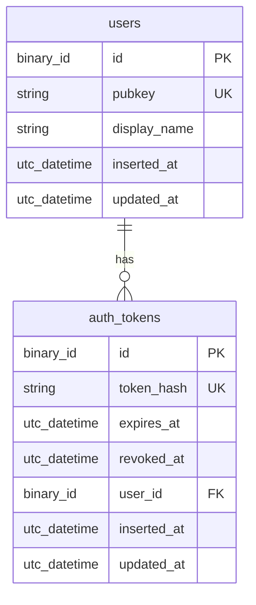

---

## Flutter Clean Architecture

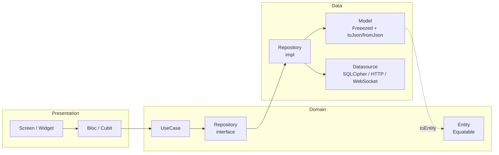

**Rules:**
- Domain layer has zero Flutter or package imports - pure Dart only
- Presentation calls UseCases only, never Datasources directly
- Freezed for all events, states, models, and value objects
- Equatable for domain entities (Bloc state diffing)

---

## Dependency Injection

GetIt + injectable handles the full graph. Singletons marked at module level via `AppModule`; factories created per-use.

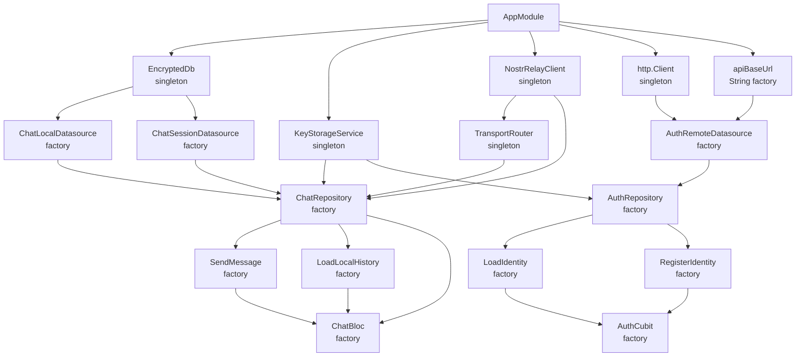

---

## BLE Protocol

BLE MTU is 20–512 bytes. JSON overhead is prohibitive at that scale, so BLE carries Nostr events as Protobuf binary.

```protobuf
syntax = "proto3";

message BleEnvelope {
  bytes          message_id  = 1;
  bytes          from_pubkey = 2;
  bytes          to_pubkey   = 3;
  int32          kind        = 4;
  int64          created_at  = 5;
  bytes          payload     = 6;  // NIP-44 ciphertext
  bytes          sig         = 7;  // BIP-340 Schnorr, 64 bytes
  uint32         ttl         = 8;
  repeated bytes via         = 9;  // relay hop pubkeys
}
```

Internet and LAN transports use NIP-01 JSON over WebSocket. BLE is the only binary transport.

---

## Peer Relay Envelope

When a message cannot reach the destination directly, it is wrapped in a `RouteEnvelope` for peer-to-peer relay. Relay nodes see only the envelope header - the payload is E2E encrypted and opaque.

```
RouteEnvelope {
  message_id  UUID        dedup / idempotency
  from_pubkey String      sender identity (hex pubkey)
  to_pubkey   String      destination identity
  via         [String]    relay hops traversed (loop detection)
  ttl         int         decrements per hop, drop at 0
  payload     Bytes       NIP-44 ciphertext, opaque to relay
  created_at  int         unix ms, reject stale (> 30s)
}
```

Relay logic per hop:
1. If `to_pubkey == self` - decrypt and deliver to inbox
2. If `ttl > 0` - decrement TTL, look up routing table, forward
3. If `ttl == 0` - drop silently

---

## Backend Supervision Tree

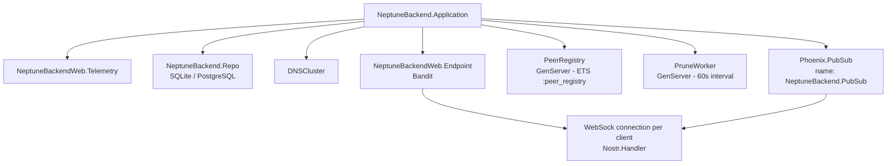

---

## Rate Limiting

The backend uses Hammer with an ETS backend to rate-limit event publishing per pubkey.

| Limit | Window | Scope |
|-------|--------|-------|
| 10 events | 1 second | Per pubkey |
| 20 concurrent subscriptions | Per connection | Per WebSocket |

Stale peer hints are pruned every 60 seconds (TTL: 300 seconds). Expired auth tokens are pruned on the same cycle.

---

## Key Technology Decisions

| Decision | Choice | Rationale |
|----------|--------|-----------|
| Wire protocol | NIP-01 (Nostr) | Open standard, relay-mesh interoperability, zero lock-in |
| E2E encryption | NIP-44 (HKDF + ChaCha20-Poly1305) | Modern, audited, Nostr ecosystem standard |
| Identity keys | secp256k1 | Supports both Schnorr signing and ECDH in one keypair |
| BLE serialisation | Protobuf | Compact binary - JSON too large for BLE MTU |
| On-device DB | SQLCipher | AES-256 encrypted SQLite, no plaintext at rest |
| Key storage | flutter_secure_storage | Hardware-backed Keychain / Keystore |
| Backend adapter | Bandit | Pure Elixir HTTP/1 + HTTP/2 + WebSocket, no C deps |
| Backend DB | SQLite (dev/test) / PostgreSQL (prod) | Self-hostable with zero external deps |
| WebSocket client | web_socket_channel | No Phoenix Channels - raw NIP-01 throughout |
| Backend signing | Pure-Elixir BIP-340 Schnorr | No NIF / native deps, portable across all platforms |
